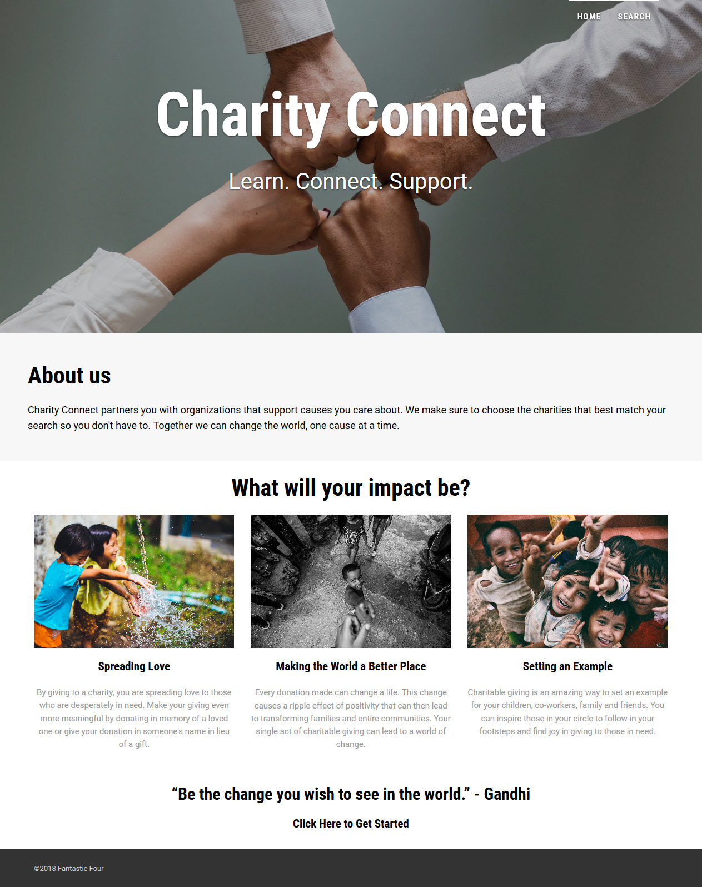

<h1>Charity Connect</h1>

<em>-Learn.  Connect.  Support.</em>

Charity Connect partners you with organizations that support causes you care about.  Together we can change the world, one cause at a time.

<h2>Description</h2>

Our web app allows users to search for charities based on causes they are interested in.  Causes can include anything from animals, poverty, homelessness, to specific regions in need of support.  It then searches the Charity Navigator API using the users input to find relevant charity information (name, rating, tag line, website, and address).  The charities are populated on a map using the Google Maps API in conjunction with the Geocoding API which translates the address into latitude and longitude coordinates.  When the user clicks on a pin, the relevant information is shown in an information window including a link to the charity's website.
  

<h2>Developers (Fantastic Four):</h2>
<ul>
<li>Alicia Perez</li>
<li>Celeste Ramirez</li>
<li>Neeha Jacob</li>
<li>Nitya Kandukuri</li>
</ul>

<h2>Link to deployed site:</h2>
<a href="https://aliperez.github.io/Charity-Connect/">Charity Connect</a>

